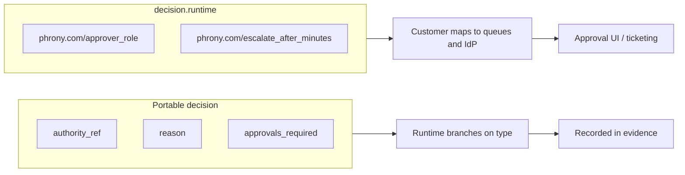

## What is a Policy?

<Note>
  **A policy is an "if this, then that" rule for actions.** *If* the agent tries to send a high-severity alert, *then* require a human to approve first. Policies are checked the moment before a tool actually runs, so a blocked action never happens — it isn't undone after the fact.
</Note>

A **Policy** document declares **when** a rule applies (`conditions`) and **what** happens (`decision`). Policies are evaluated at **dispatch time** — the instant the runtime is about to hand the call to a tool worker, i.e. before anything real happens — and during approval flows. Multiple policies merge with **deny wins** semantics: when several rules apply, the most restrictive one decides, so a single "deny" overrides any number of "allows." That makes policies safe to stack without worrying that a permissive rule will quietly open a hole.

Policies belong in `policies/` in the Agent bundle or are referenced by logical id from Tool defaults and Agent bindings.

### Concept examples

**When + what** (the whole policy in miniature):

```yaml
spec:
  conditions:
    field: severity
    op: gt
    value: 3
  decision:
    type: require_approval
    reason: Alert severity above delegated limit.
```

**Deny wins** (two rules apply; the stricter one wins):

```yaml
# Rule A: allow alerts with severity 1–3
decision: { type: allow }

# Rule B: deny all alert sends after 6pm
decision: { type: deny }

# 5pm alert at severity 2 → allowed
# 7pm alert at severity 2 → denied (deny wins)
```

**Portable vs `decision.runtime`**:

```yaml
decision:
  type: require_approval          # portable — every runtime understands
  approvals_required: 1
  runtime:
    phrony.com/approver_role: senior_weather_ops   # your IdP / queue mapping
```

## Portable core vs decision.runtime

A decision has two layers. The **portable** layer says *what* should happen in universal terms ("require one approval"). The `decision.runtime` layer says *how your specific organization wires that up* ("send it to the `senior_weather_ops` queue in our identity system"). Splitting them keeps the portable part meaningful on any runtime, while your environment-specific plumbing stays in its own clearly-labeled box.

<Info>
  **IdP** = identity provider — the system your company uses for logins, groups, and roles (Okta, Entra ID, and the like). Role and queue names belong to *your* IdP, so the spec keeps them out of the portable core and confines them to `decision.runtime`.
</Info>

The spec splits policy effects into two surfaces:

| Surface | Portable? | Purpose |
|---------|-----------|---------|
| `decision` (except `runtime`) | Yes | What every conformant runtime must understand: `deny`, `require_approval`, `allow`, … |
| `decision.runtime` | No | Implementation extensions mapped by your operator (IdP queues, SLAs, role names) |



<Warning>
  **`authority_ref` is symbolic only.** It links a decision to a name in your agent-declared authority taxonomy (for example `weather.alert-authority`). It does **not** perform authorization and must not be confused with IdP role names.
</Warning>

<Note>
  **No `approver_role` or `to_role` in the portable core.** Role strings are an IdP namespace leak; Phrony does not resolve roles in the open spec. Put role and queue mappings under `decision.runtime` (or your operator’s extension registry).
</Note>

## Minimal example — require approval

```yaml
apiVersion: phrony.com/v1
kind: Policy

metadata:
  name: high-severity-alert-boundary
  namespace: weather
  version: 1.0.0
  governance:
    authority_boundaries:
      - weather.alert-authority

spec:
  description: Alerts above the delegated severity require human approval.
  conditions:
    all:
      - field: severity
        op: gt
        value: 3
      - field: region
        op: eq
        value: US
  decision:
    type: require_approval
    authority_ref: weather.alert-authority
    approvals_required: 1
    timeout:
      after_minutes: 240
      default: deny
    on_reject: return_to_agent
    on_modify: revalidate
    comprehension_required: true
    reason: Alert exceeds handler delegated severity; senior approval required.
    runtime:
      phrony.com/approver_role: senior_weather_ops
      phrony.com/escalate_after_minutes: 30
      phrony.com/escalate_to_role: weather-ops-lead
```

## Minimal example — allow list

```yaml
apiVersion: phrony.com/v1
kind: Policy

metadata:
  name: strict-geo
  namespace: weather
  version: 1.0.0

spec:
  scope: tool:weather.get-forecast
  conditions:
    field: country
    op: in
    value: ["US", "CA", "MX"]
  decision:
    type: allow
```

Deny decisions return a `tool_result` error to the model without dispatching.

## Field reference

### Top-level

| Field | Type | Required | Description |
|-------|------|----------|-------------|
| `apiVersion` | string | Yes | Must be `phrony.com/v1` |
| `kind` | string | Yes | Must be `Policy` |
| `metadata` | object | Yes | Identity and optional governance |
| `spec` | object | Yes | Conditions and decision |

### spec.conditions

Conditions form a **tree**: leaf nodes compare tool arguments or context; interior nodes use `all`, `any`, or `not`.

| Field | Description |
|-------|-------------|
| `field` | Dotted path into tool arguments or dispatch context (for example `severity`, `phrony.dispatch.trigger`, `dispatch.outcome`) |
| `op` | Operator (`eq`, `neq`, `gt`, `gte`, `lt`, `lte`, `in`, `matches`, …) |
| `value` | Literal or list for the operator |
| `all` | Array of nested condition objects (AND) |
| `any` | Array of nested condition objects (OR) |
| `not` | Single nested condition object |

### spec.decision (portable)

| Field | When | Description |
|-------|------|-------------|
| `type` | Always | `allow`, `deny`, `require_approval`, `escalate`, … |
| `authority_ref` | Optional | Symbolic link to `metadata.governance.authority_boundaries` taxonomy |
| `approvals_required` | `require_approval` | Count of distinct approvals |
| `timeout` | `require_approval` | `after_minutes` and `default` (`deny`, `allow`, `escalate`) |
| `on_reject` | `require_approval` | For example `return_to_agent`, `fail` |
| `on_modify` | `require_approval` | For example `revalidate` — full policy chain before dispatch |
| `comprehension_required` | `require_approval` | Approver must acknowledge structured context |
| `reason` | Optional | Human-readable string stored in approval payload |

#### require_approval behavior

When `type: require_approval` matches:

1. The runtime **suspends** the session and opens an approval request.
2. Portable fields (`authority_ref`, `reason`, `approvals_required`, timeout) appear in the approval payload and evidence.
3. **`decision.runtime`** is passed through unchanged for your approval UI or ticketing integration.

`on_modify: revalidate` requires re-evaluation of the full policy chain after an approver edits proposed tool arguments.

### spec.decision.runtime (not portable)

Arbitrary key–value map under `decision.runtime`. Keys SHOULD use the `phrony.com/` prefix for well-known extensions:

| Key | Example | Meaning (implementation-defined) |
|-----|---------|----------------------------------|
| `phrony.com/approver_role` | `senior_weather_ops` | Map to IdP group or queue |
| `phrony.com/escalate_after_minutes` | `30` | SLA before escalation |
| `phrony.com/escalate_to_role` | `weather-ops-lead` | Secondary queue on timeout |

Conformant runtimes **MAY ignore** `decision.runtime`. Portable conformance is determined only by `decision.type` and portable subfields.

### spec.scope

Optional scope string (for example `tool:weather.get-forecast`) limiting which bindings the policy applies to when not referenced explicitly from a binding.

## Referencing policies

| From | Syntax |
|------|--------|
| Tool `default_policies` | `weather.high-severity-alert-boundary` (logical ref) |
| Agent binding `policies` | Same logical ref, or `ref: policies/high-severity-alert-boundary` (bundle file) |
| Agent `metadata.governance.authority_boundaries` | Compiled into policies at publish |

Logical ref format: **`namespace.name`** matching Policy `metadata`.

### Dispatch context conditions

When a dispatch fails (no handler, indeterminate outcome, and so on), the runtime evaluates policies with a **dispatch trigger** in context. Match it in conditions:

```yaml
conditions:
  field: phrony.dispatch.trigger
  op: eq
  value: dispatch:indeterminate
```

`dispatch.outcome: indeterminate` is an equivalent shorthand. Use `decision.type: escalate` or `require_approval` with `decision.runtime` (for example `phrony.com/approver_role`) for operator routing.

## Conformance summary

| Rule | Enforced? |
|------|-----------|
| Condition tree evaluated at dispatch (args + dispatch context) | Yes |
| `decision.type: escalate` on dispatch failures | Yes |
| `authority_ref` performs authz | **No** (symbolic only) |
| `decision.runtime` required for approval | No (optional) |
| `on_modify: revalidate` | Yes (full chain) |
| Deny wins across merged policies | Yes |

<UpNext>
  <Card title="Tool bindings" href="/docs/agent-spec/resources/tools">
    Binding-level policies, HITL, and merge order with Tool defaults.
  </Card>
  <Card title="Agent definition" href="/docs/agent-spec/resources/agent">
    Run-wide limits, max_hitl_wait_minutes, and on_limit escalation.
  </Card>
</UpNext>
