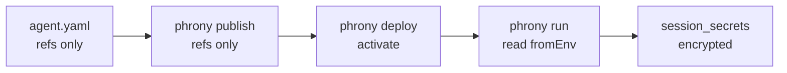

## Overview

<Note>
  **The key idea:** an agent needs credentials (like a model provider API key) to do its job, but those must never be written into a file you commit to git. So the manifest only stores the *name of where the value lives* — for example "read the environment variable `ANTHROPIC_API_KEY`" — not the value itself. The real value is read when you **start a session**, sent to the runtime once, encrypted for that session, and purged when the session finishes. It's the difference between writing "the spare key is under the mat" versus taping the actual key to the page.
</Note>

The top-level **`secrets`** section on an Agent declares **how** provider credentials are resolved when a session starts. It stores **references only** (for example an environment variable name)—never plaintext API keys in git.

```yaml
# Do not commit this
secrets:
  anthropic:
    value: sk-ant-api03-...   # rejected by tooling

# Do commit this
secrets:
  anthropic:
    fromEnv: ANTHROPIC_API_KEY   # value read at run from your shell
```

This matches the paradigm’s [credential references](/docs/paradigm/why-we-need-a-spec): credentials are declared with the Agent, supplied at session start, and used only while that session is active.

```yaml
secrets:
  anthropic:
    fromEnv: ANTHROPIC_API_KEY
  openai:
    fromEnv: OPENAI_API_KEY

spec:
  model:
    provider: anthropic
    name: claude-sonnet-4-5
    secret: anthropic   # optional when a secret named after provider exists
```

See also the [Agent definition](/docs/agent-spec/resources/agent) for how `secrets` fits alongside `metadata`, `spec`, and `output`.

## Secret definition (v1)

Each entry under `secrets` is a map key (the secret **name**) and a small object:

| Field | Type | Required | Description |
|-------|------|----------|-------------|
| `fromEnv` | string | Yes | Environment variable read **on the machine starting the session** (for example `phrony run`) |

Secret **names** must match `[a-z][a-z0-9_-]*` (stable identifiers such as `anthropic`, `openai`).

<Warning>
  Inline `value` or `plaintext` fields in `secrets` are **rejected** by conformant tooling. Do not commit API keys in the manifest.
</Warning>

v1 supports **`fromEnv` only**. Future spec versions may add `fromFile`, vault references, and other resolution sources. Backends that call the runtime over gRPC can supply values directly in `resolved_secrets` on `RunSession` instead of using `fromEnv`.

### Naming conventions

Use short, stable secret names (`anthropic`, `openai`) that match or relate to `spec.model.provider`. Set `fromEnv` to the conventional provider API key variable on the run host (for example `ANTHROPIC_API_KEY`, `OPENAI_API_KEY`).

## Linking secrets to the model

| Field | Path | Description |
|-------|------|-------------|
| `secret` | `spec.model.secret` | Names a key in `secrets` used for the model provider’s API key |

Validation rules:

- If `spec.model.secret` is set, it must name a key in `secrets`.
- If `secrets` is non-empty and `spec.model.secret` is omitted, the secret name defaults to `spec.model.provider` when that key exists in `secrets`; otherwise validation fails with a clear error.
- If `secrets` is omitted, `spec.model.secret` must not be set.

### MCP server auth

[MCP servers](/docs/agent-spec/resources/mcp-servers) can reference the same `secrets` map for `mcp_servers[].auth.secret`. At run, the runtime decrypts the session-scoped value and sets `Authorization: Bearer …` or a custom header. Omit `auth` when the MCP endpoint is public.

## Publish and session lifecycle



1. **Author** — Add `secrets` with `fromEnv` references in the Agent YAML (committed to git).
2. **Publish** — The runtime stores an immutable agent version with **ref-only** `secrets` in the manifest snapshot. No API keys are read or sent at publish. See [`phrony publish`](/docs/runtime/cli/publish).
3. **Deploy** — Activate the published version for sessions in this runtime. See [`phrony deploy`](/docs/runtime/cli/deploy).
4. **Run** — On the run host, supply each referenced env var: export them in the shell, pass `--env-file` / `-e` to `phrony run`, or send `resolved_secrets` over gRPC from your backend. The CLI resolves `fromEnv` names from the process environment (after any env files are loaded) and sends values in a separate gRPC field (not embedded in manifest JSON). The runtime encrypts each value and stores ciphertext in `session_secrets` for that session only. Requires `RUNTIME_SECRETS_ENCRYPTION_KEY` on the runtime. See [`phrony run`](/docs/runtime/cli/run) and [Runtime overview](/docs/runtime#environment-variables).
5. **Purge** — When the session reaches a terminal status (`completed`, `failed`, `cancelled`), the runtime deletes `session_secrets` rows. Non-terminal sessions (`awaiting_input`, `awaiting_approval`, `awaiting_tool`, `running`, `pending`) keep secrets so multi-turn runs and daemon recovery after restart still work.

`phrony validate` checks secret refs and can warn when local `fromEnv` variables are unset; it never reads or transmits secret values.

### Content hash and rotation

The manifest content hash used for immutable republish is computed from **ref-only** manifest bytes. Changing env values on the run host does not change that hash.

To **rotate credentials**, start a **new session** with the updated env vars (or new `resolved_secrets`). You do not need to bump `metadata.version` or republish for secret rotation alone. Republish only when the manifest itself changes (refs, model, tools, and so on).

## Security

| Topic | Guidance |
|-------|----------|
| Plaintext in git | Forbidden—`value` / `plaintext` rejected at parse time |
| Run transport | Resolved secrets cross gRPC once per session start; use TLS for remote runtimes |
| Database | Session ciphertext only until terminal; protect Postgres like any secret store |
| Master key | One `RUNTIME_SECRETS_ENCRYPTION_KEY` per runtime deployment |
| Logs | Never log secret values; run errors may name missing env vars |
| `phrony run` | Resolves `fromEnv` from the process environment; optional `--env-file` / `-e` loads a dotenv file first (shell env wins over file) |
| Attach | Resuming an existing session (`session_id`) does not accept new secrets; missing rows after upgrade return `FailedPrecondition` |

<UpNext>
  <Card title="Agent definition" href="/docs/agent-spec/resources/agent">
    Where the secrets map lives alongside metadata, spec, and output.
  </Card>
  <Card title="MCP servers" href="/docs/agent-spec/resources/mcp-servers">
    Bearer and custom header auth using the same secrets map.
  </Card>
</UpNext>
