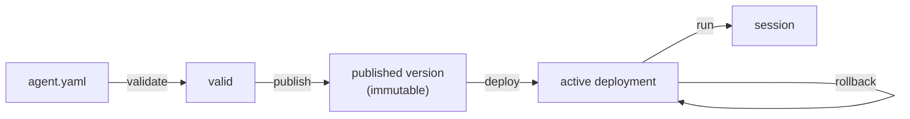

## Operator CLI

<Note>
  **`phrony` is the remote control for a running runtime.** You use it to push agents to the runtime, choose which version is live, start runs, and watch what's happening. A few commands (like checking a manifest) work entirely on your machine; most talk to the runtime server.
</Note>

The `phrony` binary is the **operator CLI** for a running Phrony runtime. It speaks gRPC to `phrony-runtime` for publish, deploy, sessions, and agent lifecycle. It also validates manifests locally without contacting the server.

### The lifecycle in plain terms

An agent goes through the same short journey every time, and most commands map to one step of it:

<Steps>
  <Step title="Author & check (on your machine)">
    Write the manifest, then `validate` it. Nothing leaves your laptop yet.

    ```bash
    phrony init ./weather-assistant
    phrony agents validate ./weather-assistant/agent.yaml
    ```
  </Step>
  <Step title="Publish (freeze a version)">
    `publish` sends a version to the runtime and freezes it forever. Publishing does **not** make it live — it's a version sitting in the library, ready but not in use.

    ```bash
    export ANTHROPIC_API_KEY="sk-..."
    phrony agents publish ./weather-assistant/agent.yaml
    # → weather/weather-assistant 2.4.0 stored (not runnable until deploy)
    ```
  </Step>
  <Step title="Deploy (make one version live)">
    `deploy` flips a switch: this published version is now the **active** one that new runs will use. `rollback` flips it back to an earlier version.

    ```bash
    phrony agents deploy weather/weather-assistant@2.4.0
    phrony rollback weather/weather-assistant   # optional: back to previous active
    ```
  </Step>
  <Step title="Run (execute the live version)">
    `run` starts a **session** — one execution of the agent — against whatever version is currently active.

    ```bash
    phrony run weather/weather-assistant
    # → run_abc123 started (uses active 2.4.0)
    ```
  </Step>
</Steps>

Why separate "publish" from "deploy"? So you can stage a new version safely and switch to it (or away from it) instantly, without re-uploading anything — the same reason deployments are separated from builds elsewhere in software.

## Install

From a runtime repository checkout:

```bash
make install-cli-path
```

Or build and place on your `PATH` manually — see [Install binaries](/docs/runtime#install-binaries).

## Connect to the runtime

The CLI resolves the runtime address in this order:

1. `--runtime-addr` on the command line
2. `PHRONY_RUNTIME_ADDR` in the environment
3. Default `127.0.0.1:7777`

```bash
phrony --runtime-addr 127.0.0.1:7777 status
```

Load `.env` from the runtime repo (or set `PHRONY_RUNTIME_ADDR`) so the CLI matches `RUNTIME_GRPC_ADDR` where the daemon listens.

## Agent references

Commands that take an agent use **`namespace/name`**:

```text
demo/echo-agent
```

Versioned references use **`namespace/name@semver`** (for example `demo/echo-agent@1.2.0`). The semver comes from `metadata.version` in the published manifest.

## Agent lifecycle

Within one runtime instance, an agent version moves through distinct steps:



| Step | CLI | Runnable? |
|------|-----|-----------|
| Author locally | [`init`](/docs/runtime/cli/init), [`agents validate`](/docs/runtime/cli/validate), [`agents diff`](/docs/runtime/cli/diff) | — |
| Publish immutable version | [`agents publish`](/docs/runtime/cli/publish) | No |
| Activate for sessions | [`agents deploy`](/docs/runtime/cli/deploy) | Yes (when active) |
| Execute | [`run`](/docs/runtime/cli/run) | Uses **active** deployment only |
| Roll back activation | [`rollback`](/docs/runtime/cli/rollback) | — |
| Retire / deprecate version | [`agents retire`](/docs/runtime/cli/retire), [`agents deprecate`](/docs/runtime/cli/deprecate) | Blocked for new sessions |

**Publish** validates the bundle, resolves refs, and stores an immutable agent version (ref-only `secrets` when declared). **Deploy** appends an activation record so that version becomes the **active** one for [`run`](/docs/runtime/cli/run). **Run** resolves secret values per session when needed. Published-but-not-deployed versions exist in the registry but cannot be executed.

Bare `phrony run demo/echo-agent` resolves the active deployed version. An explicit `demo/echo-agent@1.2.0` is allowed only when `1.2.0` is the currently active deployment in this runtime.

Each runtime instance is environment-agnostic: promoting between staging and production means publishing and deploying on separate runtime instances (typically via CI/CD), not a `target` or `promote` flag on the CLI.

### Audit actor

Publish, deploy, and rollback record an **actor** for audit. Set `PHRONY_ACTOR` on the operator host (for example `ci@github` or an email). When unset, the CLI uses the OS username.

## Commands

| Command | Server required | Summary |
|---------|-----------------|---------|
| [`init`](/docs/runtime/cli/init) | No | Scaffold `agent.yaml` |
| [`status`](/docs/runtime/cli/status) | Yes | Runtime health and version |
| [`rollback`](/docs/runtime/cli/rollback) | Yes | Roll back to a previous active version |
| [`run`](/docs/runtime/cli/run) | Yes | Start a new session (active deployment; no credentials on CLI) |
| [`sessions`](/docs/runtime/cli/sessions) | Yes | List, inspect, attach to, and cancel sessions |
| [`approvals`](/docs/runtime/cli/approvals) | Yes | List, inspect, and decide pending tool approvals (out of band) |
| [`agents`](/docs/runtime/cli/agents) | Mixed | Agent manifest and registry lifecycle (see subcommands below) |
| [`bundles`](/docs/runtime/cli/bundle) | Mixed | Multi-agent bundle lifecycle (see subcommands below) |

### Agent commands (`agents`)

| Command | Server required | Summary |
|---------|-----------------|---------|
| [`agents validate`](/docs/runtime/cli/validate) | No | Validate an agent manifest locally |
| [`agents diff`](/docs/runtime/cli/diff) | Yes | Diff local manifest against a published version |
| [`agents publish`](/docs/runtime/cli/publish) | Yes | Publish manifest (immutable version; ref-only [`secrets`](/docs/agent-spec/resources/secrets)) |
| [`agents versions`](/docs/runtime/cli/versions) | Yes | List published versions for an agent |
| [`agents inspect`](/docs/runtime/cli/inspect) | Yes | Metadata for a published version |
| [`agents deprecate`](/docs/runtime/cli/deprecate) | Yes | Mark a version as not runnable |
| [`agents retire`](/docs/runtime/cli/retire) | Yes | Retire a published version |
| [`agents deploy`](/docs/runtime/cli/deploy) | Yes | Activate a published version for sessions |
| [`agents active`](/docs/runtime/cli/active) | Yes | Show the active deployed version |
| [`agents history`](/docs/runtime/cli/history) | Yes | Deployment activation history |
| [`agents ls`](/docs/runtime/cli/agents) | Yes | List agents |
| [`agents archive`](/docs/runtime/cli/agents) | Yes | Archive an agent |

### Bundle commands (`bundles`)

Multi-agent closures use [`kind: Bundle`](/docs/agent-spec/resources/bundle). See [`bundles`](/docs/runtime/cli/bundle) for the full command reference.

| Command | Server required | Summary |
|---------|-----------------|---------|
| [`bundles ls`](/docs/runtime/cli/bundle) | Yes | List bundles registered in the runtime |
| [`bundles lock`](/docs/runtime/cli/bundle-lock) | No | Walk closure and write `bundle.lock.json` |
| [`bundles validate`](/docs/runtime/cli/bundle-validate) | No | Validate closure; compare lock when present |
| [`bundles publish`](/docs/runtime/cli/bundle-publish) | Yes | Verify committed lock and publish immutable bundle version (semver + lock hash) |
| [`bundles deploy`](/docs/runtime/cli/bundle-deploy) | Yes | Activate a published bundle semver or lock hash |
| [`bundles versions`](/docs/runtime/cli/bundle-versions) | Yes | List published bundle versions (semver + lock hash) |
| [`bundles active`](/docs/runtime/cli/bundle-active) | Yes | Show the active bundle deployment |
| [`bundles history`](/docs/runtime/cli/bundle-history) | Yes | Bundle deployment activation history |
| [`bundles run`](/docs/runtime/cli/bundle-run) | Yes | Start a session on the bundle root member |
| [`bundles secret-requirements`](/docs/runtime/cli/bundle-secret-requirements) | Yes | Inspect the union of fromEnv secret requirements for a deployed bundle |

## Global flags

| Flag | Description |
|------|-------------|
| `--runtime-addr` | Runtime gRPC address (overrides `PHRONY_RUNTIME_ADDR`) |

## Typical workflow

```bash
phrony init ./my-agent
phrony agents validate ./my-agent/agent.yaml
phrony agents publish ./my-agent/agent.yaml
phrony agents deploy demo/my-agent@0.1.0
export ANTHROPIC_API_KEY="sk-..."   # or: phrony run demo/my-agent -e .env
phrony run demo/my-agent
```
