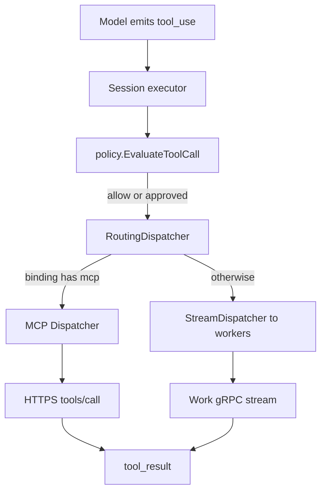

## Role of the runtime

<Note>
  **Same air-traffic controller, different runway.** For bindings declared with `mcp`, the runtime does not look for a registered worker. After policy and HITL approve the call, it opens (or reuses) a Streamable HTTP MCP session to the URL in `spec.mcp_servers`, sends JSON-RPC `tools/call`, and maps the result into the same `tool_result` shape the model loop already expects. Policy scope, approvals, `call_id` derivation, and the `tool_invocations` ledger behave like worker dispatch.
</Note>

Declare servers and bindings in the [Agent spec](/docs/agent-spec/resources/mcp-servers). This page covers runtime behavior only.

## Architecture

When a session loads an agent version that declares `spec.mcp_servers` and at least one MCP-backed binding, the runtime wraps the shared worker dispatcher in a **routing dispatcher**:

| Component | Responsibility |
|-----------|----------------|
| **Routing dispatcher** | If the logical tool ref is MCP-backed → MCP; else → existing worker `StreamDispatcher` |
| **MCP client** | Per-server Streamable HTTP session: `initialize` handshake, then `tools/call` |
| **Invocation recorder** | Same pending → dispatched → completed ledger rows as workers |

Agents with no MCP servers, or MCP servers with no bound tools, reuse the worker dispatcher only—no extra allocation on the common path.

## Session lifecycle

1. **Load version** — Compiled snapshot includes `spec.mcp_servers` and MCP bindings.
2. **Build routing dispatcher** — For each referenced server, decrypt `auth.secret` (when configured) and configure request headers. One MCP client per server is reused for the session.
3. **Tool-use loop** — Unchanged: policy runs before dispatch; parallel calls in one turn still run concurrently.
4. **Close session** — Per-session MCP clients are closed; the shared worker dispatcher stays open for other sessions.

Auth header resolution:

| `auth.scheme` | Header sent |
|---------------|-------------|
| `bearer` | `Authorization: Bearer <decrypted secret>` |
| `header` | `<auth.header>: <decrypted secret>` |

Secrets are decrypted from session-scoped storage like model API keys—see [Secrets](/docs/agent-spec/resources/secrets).

## Transport

v1 uses **Streamable HTTP** only (`transport: streamable_http`, the default when omitted). The runtime uses the official MCP Go SDK client with POST-based `tools/call`; standalone SSE streams are not required for public endpoints that only accept POST.

Requirements on `url`:

- Valid **HTTPS** URL (validated at `phrony agents validate`)
- Reachable from the runtime process (network egress, TLS, and firewall rules are operator concerns)

## Ledger and recovery

MCP calls write the same **`tool_invocations`** ledger as worker calls: pending before the HTTP request, dispatched when the call is in flight, then completed or marked indeterminate. Startup [reconciliation](/docs/runtime/tool-durability) and `call_id` semantics are unchanged—see [Tool dispatch](/docs/runtime/tool-dispatch#idempotent-call-ids) and [Durability and recovery](/docs/runtime/tool-durability).

## Failure modes

| Outcome | Typical cause | Runtime behavior |
|---------|---------------|------------------|
| **Tool error** | Remote MCP returns `isError` on the result | `tool_result` with error content; not indeterminate |
| **Indeterminate** | Timeout, connection reset, or transport failure after dispatch may have reached the server | `ErrIndeterminate`; recovery follows binding `side_effect_class` (same as workers) |
| **No handler** | Binding not MCP-backed and no worker registered | Worker path: queue or fail—see [Tool dispatch](/docs/runtime/tool-dispatch#failure-modes) |

Transport failures are treated as **indeterminate** because the server may have executed the tool before the response was lost. For `non_idempotent_write` and `irreversible_action` bindings, the runtime does not silently redispatch—pair with [Policy](/docs/agent-spec/resources/policy) for `dispatch:indeterminate` or rely on the side-effect default escalation.

Worker-specific conditions (**no handler**, **capacity exhausted**, **lease expired**) apply only to worker-backed tools. MCP tools do not use the worker registry or lease heartbeats.

## Integrity and workers

MCP-backed tools do not use the worker **allowlist** (workload identity, image digest). Governance for MCP tools is manifest-side: policies, `input_schema`, and explicit `side_effect_class`. Worker [integrity](/docs/runtime/tool-integrity) remains required for bindings that dispatch over the `Work` stream.

## Operator checklist

| Step | Action |
|------|--------|
| Manifest | Add `spec.mcp_servers` and `mcp` on bindings with `input_schema` and `side_effect_class` |
| Secrets | Declare `auth.secret` in `secrets` with `fromEnv`; run with env vars set or `phrony run -e .env` |
| Validate | `phrony agents validate ./agent` — HTTPS URL, secret refs, MCP binding rules |
| Network | Ensure the runtime can reach each `url` over HTTPS |
| Policies | Attach allow / `require_approval` rules with `tool:<ref>` scope as for worker tools |

<UpNext>
  <Card title="MCP servers (spec)" href="/docs/agent-spec/resources/mcp-servers">
    spec.mcp_servers, binding mcp, auth, and validation rules.
  </Card>
  <Card title="Tool dispatch" href="/docs/runtime/tool-dispatch">
    Policy gate, loop, and shared failure vocabulary.
  </Card>
</UpNext>
