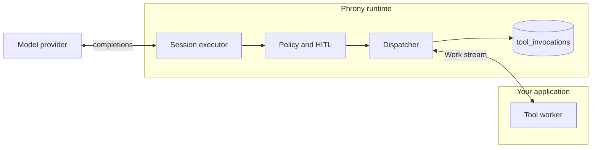

## Role of the runtime

<Note>
  **The runtime is a dispatcher, not a doer.** When the AI model decides to use a tool, the runtime doesn't run that tool itself. It acts like an air-traffic controller: it checks the request against the rules, routes it to a separate process that actually does the work (a **worker**), writes down what happened, and passes the result back to the model. This separation is what makes every tool call governed and recorded.
</Note>

The runtime **never executes tool code**. On every model-emitted tool call it:

1. Evaluates manifest **policies** and **human-in-the-loop (HITL)** rules — *is this allowed, and does a human need to approve?*
2. **Authorizes and routes** the call to an application **worker** or, for [MCP-backed](/docs/agent-spec/resources/mcp-servers) bindings, to a remote **MCP server** — *who actually does this?*
3. **Records** the invocation in a durable **ledger** (a permanent log in the database) and returns a `tool_result` to the model — *write it down, then answer.*

Your application connects workers over gRPC; the model loop only sees `tool_call` → `tool_result`. It never knows or cares where the work physically ran.

### Concept examples

**Policy check** (before any real work runs):

<ToolDispatchPolicyCheckIllustration />

Operators approve with [`phrony approvals`](/docs/runtime/cli/approvals) or the `DecideApproval` gRPC — see [Human-in-the-loop approvals](/docs/runtime/hitl).

**Dispatch** (after approval or when allowed):

<ToolDispatchInvokeIllustration />

**Ledger entry** (written before the worker is called):

```json
{ "call_id": "run_abc:turn1:0", "tool": "send_alert", "status": "dispatched" }
```

**Deterministic `call_id`** (same call after restart gets the same id):

```text
session_id=run_abc  turn=1  index=0  →  call_id always "run_abc:…:turn1:0"
```

## Architecture

Tool dispatch is split into three layers so transport and enforcement can evolve without changing the executor loop.

| Layer | Responsibility |
|-------|----------------|
| **Dispatch contract** | Stable `ToolCall` → `ToolResult` interface. The session executor only depends on this contract. |
| **Transport binding** | Worker tools: bidirectional **`Work`** gRPC stream (workers connect to the runtime). MCP tools: native **Streamable HTTP** client to `spec.mcp_servers` URLs—see [MCP tool dispatch](/docs/runtime/mcp-tools). |
| **Integrity model** | Before dispatch, the routed worker is checked against a deployment **allowlist** (workload identity, approved image digest, contract version). Descriptor hashes are recorded for audit; they are not the enforcement gate. |



Bindings with `mcp` set bypass the worker registry; the routing dispatcher sends those logical refs to the MCP client while other tools still use the `Work` stream.

## Tool-use loop

Each **loop iteration** is one model completion, not one tool call.

1. Build messages (system, history, user, prior `tool_result` blocks).
2. Present `spec.tools` contracts to the provider and call **Complete**.
3. If the stop reason is **`tool_use`**, for each call: evaluate policy → dispatch → append `tool_result` → continue.
4. Parallel calls in one turn are dispatched concurrently; the loop waits for **all** results before the next completion.
5. The loop ends on **`end_turn`**, or when `max_loop_iterations`, token, or wall-clock limits fire.

When `spec.limits.on_limit` is **`escalate`**, limit breaches can route to HITL instead of always halting the session.

### While a tool is in flight

A tool-use turn is **not** one long model call. The provider connection closes at `tool_use`; the next completion runs only after results are appended.

| Resource | During tool wait |
|----------|------------------|
| **Inference / tokens** | None — no open provider connection; tokens do not accrue. |
| **Wall clock** | Still counts against `max_wall_clock_seconds`. Each call gets a deadline from the remaining budget. |
| **Loop iterations** | Unchanged — each completion is one iteration; waiting is not an extra iteration. |
| **Session status** | `awaiting_tool` (durable). Interactive clients see a `tool_call` event; input stays blocked until the call resolves. |

Cancel the session to abort an in-flight wait; the runtime cancels the worker lease for that call.

## Idempotent call IDs

Each tool call gets a **`call_id`** that is computed from the same inputs every time (the session, the agent version, the turn, and the position of the call in that turn) rather than randomly. So if the runtime restarts and re-issues a call, it carries the *same* id as before. The worker can recognize "I've already done this one" and avoid doing it twice — which is exactly what makes recovery safe for actions you don't want to repeat.

Every dispatch uses a deterministic **`call_id`** derived from `session_id`, `agent_version_id`, **turn**, and **tool-call index** within that turn. The same logical call after a restart gets the same id, which makes durable recording and safe redelivery possible.

## Failure modes

Not every problem is the same kind of problem, so the runtime names four distinct ones instead of lumping them into "dispatch failed." Two terms used below:

- A **lease** is a worker's temporary claim on a call — like a "now serving" ticket that must be renewed (via heartbeat) or it expires. If it expires mid-call, the runtime no longer knows if the work finished.
- **Indeterminate** means the outcome is genuinely unknown: the worker may have done the action, or may not have. For risky tools, the runtime refuses to guess and asks a human.

The runtime distinguishes four routing outcomes (separate errors and persistence), not a single “dispatch failed”:

<ToolDispatchFailureModesIllustration />

| Condition | Typical cause | Runtime behavior |
|-----------|---------------|------------------|
| **No handler** | No worker registered for `tool@version` | Enqueue in the same bounded FIFO as capacity; session parks at `awaiting_tool` until a worker registers or a queue wait limit triggers fail or escalate. Queue wait is capped by **`RUNTIME_DISPATCH_QUEUE_WAIT`** (default `10s`) even when the session wall-clock budget is much longer—see [Environment variables](/docs/runtime#environment-variables). |
| **Capacity exhausted** | Workers exist but none idle | Enqueue in a bounded FIFO per `tool@version`; wait burns wall-clock, not tokens. On deadline or full queue → fail or escalate. Nothing has been dispatched yet, so queuing is safe for side-effecting tools. |
| **Lease expired** | Worker stopped heartbeating before result ack | Outcome may be unknown; recovery applies side-effect policy. |
| **Indeterminate** | Worker died after acking execution but before durable result | No silent double-execution for non-idempotent tools → HITL. |

Handler-reported failures (validation, business logic) are returned in **`tool_result`** content with an error flag; they are separate from infrastructure errors above.

## Manifest surface

Agents declare tool bindings and attach [Policy](/docs/agent-spec/resources/policy) documents for authorization and human-in-the-loop. See [Tool bindings](/docs/agent-spec/resources/tools) for `spec.tools` and `default_policies`.

<UpNext>
  <Card title="MCP tool dispatch" href="/docs/runtime/mcp-tools">
    Route MCP-backed bindings over Streamable HTTP with the same policy and ledger.
  </Card>
  <Card title="Application workers" href="/docs/runtime/tool-workers">
    Connect over the `Work` stream, register handlers, and return results.
  </Card>
</UpNext>
