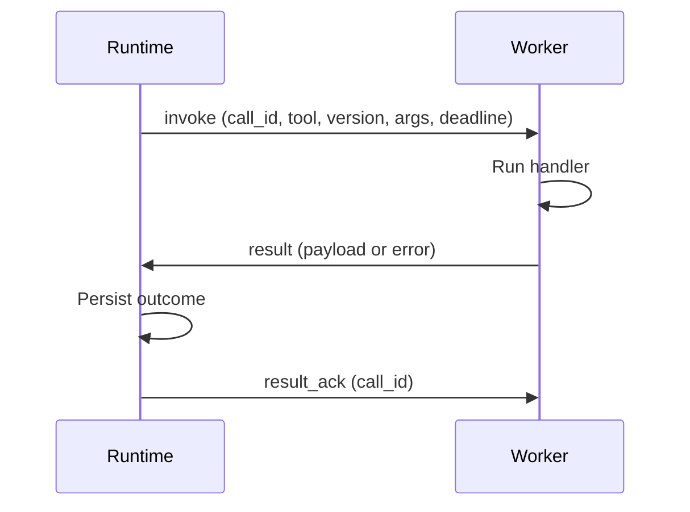

## Overview

<Note>
  **A worker is a process you run that does the actual tool work.** The runtime decides *which* tool to call and *whether it's allowed*; the worker is the code that knows *how* to call your forecast API or query your database. Think of workers as staff clocking in: each one tells the runtime "I'm here, and I can handle these jobs," then receives jobs and reports back.
</Note>

Application **workers** are long-lived processes that:

1. Open a bidirectional **`Work`** gRPC stream to the runtime — one persistent connection both sides can send messages over, so the runtime can push jobs and the worker can push results without reconnecting each time.
2. **Register** the `tool@version` handlers they implement (with capacity and contract metadata) — "here's what I can do and how many at once."
3. Receive **`invoke`** messages, run handler code, and send **`result`** (the answer) or **`nack`** ("I can't take this one").
4. Send **heartbeats** to renew their lease — a periodic "still alive" ping so the runtime knows the worker hasn't died mid-job.

The runtime routes model-emitted calls to registered workers. Workers do not call the model; they only execute tools.

### Concept examples

**Register** (first message on the `Work` stream):

```yaml
worker_id: worker-7
handlers:
  - tool: weather.get-forecast
    version: "1.0.0"
    max_concurrency: 4
```

**Invoke → result → ack**:

```text
Runtime → invoke(call_id=c1, tool=weather.get-forecast, args={ city: "Oslo" })
Worker  → result(call_id=c1, payload={ temp_c: 12 })
Runtime → result_ack(call_id=c1)    # worker may drop local state now
```

**Heartbeat** (keeps the lease alive):

```text
every ~TTL/2 seconds: worker → heartbeat
lease expired + no heartbeat → runtime treats worker as gone
```

<Tip>
  **Why hold results until `result_ack`?** The worker keeps a finished result until the runtime confirms it saved it (`result_ack`). If either side restarts in between, the result isn't lost — the worker re-offers it on reconnect and the runtime recognizes the `call_id` so the work is never counted twice.
</Tip>

## Connect and register

Use the generated client for `phrony.runtime.v1.Runtime` / `Work`:

```text
Runtime.Work(stream WorkClientMsg) returns (stream WorkServerMsg)
```

**First client message:** `register` with:

| Field | Description |
|-------|-------------|
| `worker_id` | Stable id for this process instance |
| `workload_identity` | Workload identity (for example SPIFFE ID, mTLS subject, or deployment label) checked against the [tool allowlist](/docs/runtime/tool-integrity) when configured |
| `image_digest` | OCI image digest of the running worker image |
| `handlers` | List of `tool`, `version`, `contract_version`, `descriptor_hash`, `max_concurrency` |
| `in_flight` | Optional `call_id`s still executing or holding a result awaiting runtime ack (reconnect **resync**) |

The runtime responds with `registered` and a **lease TTL**. Send `heartbeat` before the lease expires (typically at half the TTL interval).

## Invocation lifecycle



| Server → worker | Meaning |
|-----------------|--------|
| `invoke` | Run one call; includes `call_id`, `session_id`, `args`, `side_effect_class`, deadline |
| `cancel` | Session cancelled; stop work for `call_id` |
| `result_ack` | Durable result recorded; worker may drop local state for `call_id` |

| Worker → server | Meaning |
|-----------------|--------|
| `result` | Success (`payload`) or handler error (`error` code + message) |
| `nack` | Worker refuses or cannot run the call (routing-level) |

Hold results until **`result_ack`**. On reconnect, re-advertise in-flight `call_id`s in `register` so the runtime can dedupe and resume.

## Handler advertisement

Each handler advertises a routing key **`tool@version`** that must match the manifest binding **`ref`** and **`version`** (not necessarily the wire name shown to the model).

Example manifest binding:

```yaml
spec:
  tools:
    - ref: weather.get-forecast
      version: "1.0.0"
      side_effect_class: read_only
```

The worker registers `tool: weather.get-forecast`, `version: 1.0.0`, plus `contract_version` and `max_concurrency`.

## Environment variables

Typical worker configuration:

| Variable | Description |
|----------|-------------|
| `PHRONY_RUNTIME_ADDR` | Runtime gRPC address (default `127.0.0.1:7777`) |
| `WORKER_ID` | Instance id |
| `WORKER_WORKLOAD_IDENTITY` | Identity for allowlist checks |
| `WORKER_IMAGE_DIGEST` | Image digest for allowlist checks |

## Example worker

The [tool-worker-playground](https://github.com/phrony-platform/tool-worker-playground) repository is a minimal Go worker that registers a weather handler and connects to a local runtime. Use it as a reference implementation for stream handling, heartbeats, and dispatch.

## Interactive sessions

When a session runs with attach/streaming, clients receive **`tool_call`** and **`tool_result`** events on the interactive stream, and **`approval_required`** when HITL blocks a call. Approvals use a separate client message on the interactive RPC.

<UpNext>
  <Card title="Tool dispatch" href="/docs/runtime/tool-dispatch">
    Loop, failure modes, and session behavior.
  </Card>
  <Card title="Integrity and allowlist" href="/docs/runtime/tool-integrity">
    Approve workers before dispatch.
  </Card>
</UpNext>
